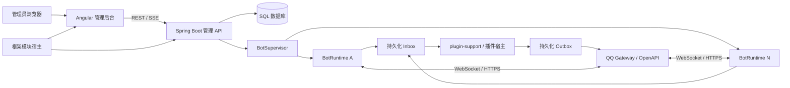

# QQ 机器人框架模块与插件平台需求文档

| 项目 | 内容 |
| --- | --- |
| 文档状态 | 0.3.0 实现基线 |
| 版本 | 0.3.0 |
| 最后更新 | 2026-07-21 |
| 目标平台 | Debian + Docker Compose |

## 1. 项目背景

本项目用于构建一个可复用的 QQ 机器人 API 接入库及其配套运行平台。平台功能通过框架模块拆分，机器人业务通过插件实现；系统需要同时管理和运行多个 QQ 机器人，并提供基于 Angular 的 Web 管理后台。

项目最终交付物不是单一前端或单一 SDK，而是以下组件的组合：

1. 可独立引用的 QQ Bot Java 接入库。
2. 支持多机器人的服务端运行时。
3. 稳定、版本化的框架模块 API、SPI 和宿主。
4. 由 `plugin-support` 模块承载的插件 API、SPI、测试工具、加载与绑定能力。
5. Angular Web 管理后台及模块 Web 贡献入口。
6. SQLite、MySQL、PostgreSQL 持久化实现。
7. 面向 Debian 的 Docker Compose 部署文件。

## 2. 术语

- **多机器人**：一个应用进程同时连接并管理多个 QQ Bot AppID。
- **多实例**：同时运行多个本系统应用容器，并由它们共同承担机器人连接和任务处理。
- **框架模块**：放在 `/modules`、启动前加入核心类路径、实现一组平台功能并由模块宿主管理依赖和生命周期的可信 JAR 制品。
- **插件制品**：一个可安装的插件 JAR 文件。
- **插件绑定**：插件与某个机器人的启用关系及独立配置。
- **插件实例**：由一个插件绑定创建的运行中对象。
- **Inbox**：已经可靠接收、等待业务处理的平台事件。
- **Outbox**：已经可靠记录、等待发送到 QQ 或外部系统的任务。

## 3. 项目目标

### 3.1 核心目标

- 支持在同一套系统中新增、配置、启停和监控多个 QQ 机器人。
- 封装 QQ Access Token、OpenAPI、Gateway、事件和消息发送协议。
- 使用插件实现机器人业务，插件不直接管理机器人密钥和底层连接。
- 使用稳定模块 API/SPI 拆分平台功能，模块可声明依赖、交换服务并贡献后台内容。
- 提供 HTTP API 和 Angular 管理后台修改配置、增加机器人和管理插件。
- 默认使用 SQLite，部署时可切换为 MySQL 或 PostgreSQL。
- 使用 Docker Compose 部署到 Debian 系统。
- 在不依赖 Redis 的前提下提供可靠事件处理和数据库协调机制。

### 3.2 非目标

当前版本仍不包含以下能力：

- 不可信第三方插件的进程内安全沙箱。
- 通过 Web 或 `/plugins` 目录运行时上传、安装或卸载框架模块。
- 插件之间直接依赖或共享运行时对象。
- Redis、Kafka、RabbitMQ 等额外基础设施。
- SQLite 模式下的多应用实例和高可用部署。
- 对 exactly-once 处理语义的承诺。
- 数据库之间的机器人、Inbox、Outbox 等业务数据自动迁移。

## 4. 技术方案

### 4.1 推荐技术栈

- 前端：Angular 22、TypeScript、Angular Router、Reactive Forms、HttpClient。
- 后端：Java 21、Spring Boot 3.x、Spring Security。
- 构建：Gradle Kotlin DSL 多模块工程。
- 插件运行时：PF4J，插件公共契约使用纯 Java 接口。
- 数据访问：Spring JDBC，复杂并发 SQL 使用数据库方言适配器。
- 数据库迁移：版本化迁移脚本，按公共脚本和数据库方言组织。
- 测试：JUnit、Testcontainers、QQ 协议测试桩、Angular 单元与端到端测试。
- 部署：Docker、Docker Compose；Caddy 或 Nginx 仅为可选反向代理。

### 4.2 架构形态

第一版采用模块化单体，不拆分微服务。核心 Boot JAR 通过 `PropertiesLauncher` 在启动前加载 `/modules/*.jar`；模块宿主在创建模块 Bean 前统一校验 JSON 描述符、版本和依赖图，再按拓扑顺序启动。模块变更需要重启，不支持热卸载。Angular 后台壳由核心提供，各模块的编译后 Web Component 由所属 JAR 同源提供，反向代理可选。



### 4.3 模块分层

```text
框架核心
  qqbot-module-api       模块描述符、依赖、服务键和 Web 贡献
  qqbot-module-spi       FrameworkModuleLifecycle 与 ModuleContext
  qqbot-module-host      JAR 扫描、依赖图、生命周期、服务注册表和资源目录

框架功能模块
  database-support       数据库、迁移、持久化和在线配置
  qqbot-runtime          QQ 接入、多机器人、可靠消息和媒体
  platform-admin         认证、首次设置、系统 API 和后台应用壳
  plugin-support         机器人插件 SDK、加载、上传、绑定和投递
  operations             健康、Dashboard、审计和队列查询
  cluster-support        租约、fencing 和多实例一致性

内部技术库
  qqbot-domain / protocol / client / gateway / runtime / persistence
  qqbot-plugin-api / spi / host / testkit

交付层
  qqbot-admin-web         Angular 管理后台
  qqbot-app               Spring Boot 启动器和 Docker 镜像
```

框架功能模块通过版本化描述符声明依赖，宿主按拓扑顺序启动并反序停止。模块间共享能力通过类型化服务注册表完成，消费方只能读取已声明依赖模块发布的服务。机器人插件不是框架模块，只能依赖 `qqbot-plugin-api` 和 `qqbot-plugin-spi`，由 `plugin-support` 加载和绑定，不得依赖 Spring、PF4J、数据库实体或 QQ 原始传输实现。

### 4.4 可复用库边界

- `qqbot-domain`、`qqbot-protocol` 和 `qqbot-client` 必须能够脱离 Spring、Angular、数据库和 PF4J 单独使用。
- `qqbot-module-api` 和 `qqbot-module-spi` 必须能够作为独立 SDK 发布，不依赖模块宿主或功能模块实现。
- 框架模块可携带 Spring 自动配置、同源 Web Component 和按数据库方言隔离的迁移；资源必须由活动模块自己的 JAR 命名空间提供。
- 可复用模块发布为普通独立 JAR 和可选 Maven 制品，并遵循语义化版本规则；平台提供的依赖使用 `compileOnly`。
- 公共 API 不暴露具体 HTTP Client、JSON 框架、数据库或依赖注入容器类型。
- QQ 原始协议 DTO 与稳定领域模型分离，协议变化不得直接破坏插件 API。
- 发布物必须包含源码包、API 文档、变更记录和最小接入示例。
- CI 使用二进制兼容检查阻止未声明的破坏性 API 变更。

## 5. QQ 机器人接入需求

### 5.1 凭据与鉴权

- 使用 AppID 和 AppSecret 获取 Access Token，不使用已废弃的旧 Token 鉴权。
- 每个机器人拥有独立的 TokenProvider。
- Access Token 默认仅保存在内存，可在需要时重新获取。
- Token 刷新必须按机器人执行 single-flight，避免并发刷新风暴。
- AppSecret 必须加密入库，且不得返回给前端、插件或日志系统。
- 所有 QQ API 请求由核心库统一添加鉴权、超时、追踪信息和错误解析。
- 沙箱与正式环境必须作为机器人级配置隔离，禁止共享 Gateway Session、目标 ID 或运行状态。
- AppSecret 轮换、机器人封禁和权限下降必须转换为可诊断的独立运行状态。

### 5.2 Gateway 与事件

- 第一版必须支持 WebSocket Gateway 接入。
- 必须实现 Hello、Identify、Ready、Heartbeat、Heartbeat ACK、Resume、Reconnect 和 Invalid Session。
- 必须保存机器人级 `session_id`、最新序列号和必要的恢复信息。
- 必须处理连接退避、Session 创建配额、Intents 和官方 Shard 参数。
- QQ 事件必须转换为稳定的插件领域事件，插件不得依赖易变化的原始 DTO。
- 对未知事件类型和未知字段应保持向前兼容，至少能够记录并安全忽略。
- Webhook 接入保留传输层扩展点，但不列为第一版强制交付范围。

### 5.3 消息接收

核心事件至少覆盖：

- 单聊消息。
- 群聊 @ 机器人消息。
- 平台授权后的群聊全量消息。
- 文字子频道消息。
- 频道私信消息。
- 消息按钮交互事件。
- 机器人加入、移除及相关生命周期事件。

事件可能重复、重放或乱序。系统必须使用平台事件 ID 或消息 ID 做持久化去重，不得依赖内存去重保证正确性。

### 5.4 消息发送

- 支持单聊、群聊、文字子频道和频道私信的消息发送接口。
- 支持文本、Markdown、按钮、Ark、Embed 及平台允许的其他消息类型。
- 支持图片、语音、视频和文件的预上传及发送。
- 被动回复必须正确使用 `msg_id` 或 `event_id`。
- 使用 `msg_id + msg_seq` 避免同一回复被平台重复接受。
- 核心发送层统一执行机器人级和目标级限频。
- 必须区分可重试错误、不可重试错误、频控错误和结果未知错误。
- URL 报备、消息权限、主动消息开关等平台限制应形成明确错误信息。
- 外部媒体 URL 必须限制协议、重定向、下载大小、超时和目标地址，防止 SSRF。
- 本地媒体上传必须限制文件类型和大小，并保证临时文件在成功、失败或超时后均被清理。

## 6. 多机器人运行时

### 6.1 BotSupervisor

`BotSupervisor` 负责将数据库中的期望状态调和为实际运行状态，至少支持：

- 新增机器人后启动连接。
- 禁用机器人后停止接收和发送。
- 修改 Intents 或凭据后平滑重建该机器人运行时。
- 单个机器人失败时不影响其他机器人。
- 展示连接状态、最近心跳、最近错误和重连次数。
- 机器人配置使用 revision 进行乐观锁控制，旧版本配置不得覆盖新版本。

### 6.2 BotRuntime 隔离

每个机器人必须独立持有：

- 凭据和 Access Token 状态。
- Gateway Session 和序列号。
- Intents 与 Shard 配置。
- 限流器、事件队列和发送队列。
- 插件绑定及插件实例。
- 运行指标和错误状态。

### 6.3 多应用实例

- SQLite 模式禁止启动多个应用实例共同处理同一个数据库。
- MySQL 和 PostgreSQL 模式允许多应用实例。
- 多实例模式使用数据库租约表和 fencing token 分配机器人或 Shard 所有权。
- 租约必须支持续租、过期接管和优雅释放。
- 旧实例失去租约后必须停止该机器人连接与消息发送。
- Inbox 任务领取使用数据库事务和对应方言的安全并发领取实现。

## 7. 插件系统

### 7.1 插件模型

- 插件系统是 `plugin-support` 框架模块提供的机器人功能实现机制，不把单个机器人插件登记为框架模块。
- 一个插件 JAR 对应一个 PluginArtifact 和一个 ClassLoader。
- 一个插件可以绑定多个机器人。
- 每个 `pluginId + botId` 创建独立 PluginInstance。
- 每个绑定具有独立启用状态、配置、权限和处理记录。
- 第一版默认只支持机器人作用域插件，不支持跨机器人共享可变状态。
- 多应用实例模式下，各实例必须加载相同哈希的插件制品；不一致时不得取得对应机器人租约。

### 7.2 插件 Manifest

Manifest 至少声明：

- 稳定插件 ID。
- 插件名称和版本。
- 插件 API 兼容范围。
- 入口类。
- 配置 JSON Schema。
- 所需能力。
- 所需能力；制品 SHA-256 由宿主读取 JAR 后计算，不由插件自报。

当前插件 API 级别为 `2.0.0`。插件只通过 `BotPluginFactory.create(PluginRuntimeContext)` 创建绑定实例，在 `BotPlugin.start()` 中使用 `EventService` 注册命名 handler；不提供旧工厂或 `BotPlugin.onEvent(...)` 兼容回退。宿主必须在执行插件代码前完成 Manifest、API 兼容性和授权校验。

### 7.3 插件能力

插件可按需获得以下受控能力：

- EventService。
- MessageSender。
- MediaService。
- PluginStorage。
- PluginScheduler。
- 受限 HTTP Client。
- 插件专用 Logger。
- 只读 ConfigSnapshot。

插件不得获得 AppSecret、Access Token、Spring ApplicationContext、宿主数据库连接或其他机器人实例。

插件公共接口只使用 Java 标准类型、`CompletionStage` 和本项目稳定领域类型，不暴露 Kotlin 协程、Reactor、Jackson、Spring 或 PF4J 类型。

### 7.4 生命周期与隔离

- 支持安装发现、校验、启动、停止、启用和禁用。
- 配置变更采用停止旧实例并重建新实例的方式生效。
- 可信插件支持管理员网页上传；宿主在校验通过后执行同进程无重启升级，并在失败时尝试恢复旧 ClassLoader 和制品。
- 每个插件绑定使用独立有界执行队列、并发限制、超时、有限重试和 DLQ。
- 插件不得运行在 Gateway、HTTP 回调或数据库 I/O 线程中。
- 插件停止时，宿主统一释放订阅、调度任务、HTTP 客户端和执行器。
- 停用插件时先停止新投递并等待在途任务；未开始及待重试任务进入暂停状态，重新启用后继续处理。
- 插件配置必须经过 Manifest 中的 JSON Schema 校验，并向后台返回具体字段错误。

### 7.5 插件安全边界

PF4J 类加载隔离不构成安全沙箱。第一版只允许运维人员部署可信插件 JAR，插件目录通过 Docker Volume 挂载。若未来开放不可信第三方插件，必须改为独立进程或独立容器，通过受控 RPC 接口接入。

## 8. 数据库需求

### 8.1 支持范围

| 数据库 | 默认 | 使用场景 | 多应用实例 |
| --- | --- | --- | --- |
| SQLite | 是 | 单机、轻量部署 | 不支持 |
| MySQL 8+ | 否 | 中大型部署、已有 MySQL 运维体系 | 支持 |
| PostgreSQL 15+ | 否 | 中大型部署和优先推荐的扩展模式 | 支持 |

默认使用 SQLite。数据库可通过启动配置、候选配置文件或 Web 后台设置，并允许在单实例内安全热切换；第一版不提供数据库间业务数据迁移工具。

### 8.2 SQLite 要求

- 默认文件路径为 `/data/qqbot.db`。
- 启用 WAL、外键约束和合理的 busy timeout。
- 数据库文件必须位于本地持久化卷，不支持 NFS 等网络共享文件系统。
- SQLite 模式只允许运行一个应用实例。
- 备份使用 SQLite Backup API 或经过验证的一致性备份流程，不直接复制正在写入的数据库文件。

### 8.3 数据库热切换

- 活动配置与人工候选配置分离，候选连接验证失败时不得覆盖活动配置。
- 切换前必须完成连接、schema、读取和事务回滚范围内的写入检查。
- DataSource 切换必须等待已借出的连接归还，并在配置提交失败时恢复旧 DataSource。
- 目标库完全未写入时先执行迁移并复制当前唯一管理员，不复制机器人、Inbox 或 Outbox 数据。
- 非空目标库缺少当前管理员时拒绝切换，避免切换后失去后台访问能力。
- 使用 revision 做乐观并发控制，同一时刻只允许一个切换操作。
- MySQL/PostgreSQL 密码只写，通过主密钥加密后保存，读取 API 不返回密码。

### 8.4 跨数据库兼容

- 领域层和插件 API 不暴露数据库方言。
- UUID 使用可移植字符串表示，时间统一使用 UTC。
- 插件配置和通用 JSON 数据使用文本字段，不依赖 JSONB。
- 公共迁移和方言迁移脚本分目录维护。
- 三种数据库必须执行同一套 Repository 契约测试。
- 插件第一版通过命名空间化的 PluginStorage 保存 JSON 或键值数据，不直接执行任意 SQL。

### 8.4 无 Redis 约束

- 系统不依赖 Redis，不提供 Redis Compose 服务。
- SQL 数据库是唯一真实数据源。
- 允许使用可丢弃、可重建的进程内有界缓存。
- 多实例配置同步通过数据库 revision、轮询或数据库事件表完成。
- 分布式租约、限流状态和可靠队列均由 SQL 数据库实现。

### 8.5 核心数据表

至少包含：

- `bots`：机器人配置、密文凭据、启用状态和 revision。
- `bot_runtime_state`：连接、Session 和诊断状态。
- `plugin_artifacts`：插件元数据、版本和哈希。
- `bot_plugins`：机器人与插件绑定及配置。
- `event_inbox`：平台事件、去重键和处理状态。
- `plugin_deliveries`：事件到插件处理器的独立投递记录。
- `outbox_jobs`：消息发送和可靠异步任务。
- `dead_letters`：超过重试上限的任务。
- `bot_leases`：多实例机器人或 Shard 所有权。
- `audit_logs`：后台配置和插件操作审计。
- `admin_users`：后台用户和权限。

## 9. 可靠性要求

### 9.1 事件流程

```text
接收并解析事件
  -> Inbox 事务提交和去重
  -> 异步创建插件投递记录
  -> 插件处理
  -> Outbox 记录副作用
  -> 发送到 QQ API
```

- 平台传输确认与插件业务成功必须解耦。
- 事件处理语义为 at-least-once。
- 每个 `(event, plugin binding, handlerId)` 具有独立幂等记录。
- 同一会话分区内默认串行，不同会话可并行处理。
- 失败任务执行有限退避重试，超过上限进入 DLQ。
- 进程崩溃或容器重启后，未完成任务必须可继续处理。

### 9.2 优雅停机

- 停止接受新的后台变更。
- 停止新的插件投递。
- 等待或中止在途插件任务。
- 保存 Gateway 恢复状态。
- 释放机器人租约并关闭连接。
- 容器停止超时必须可配置。

### 9.3 外部依赖故障

- 数据库暂时不可用时应用保持存活但退出就绪状态，并使用有上限的退避重连。
- QQ Gateway 或 OpenAPI 暂时不可用时仅影响对应机器人，不能导致整个进程永久退出。
- 数据库事务提交前不得向平台或管理端宣称事件已经可靠接收。
- 数据库恢复后，应用必须自动恢复租约、Inbox、Outbox 和机器人调和流程。
- 本地内存缓存丢失不得造成业务数据丢失或无法恢复。

## 10. HTTP API 与 Angular 后台

### 10.1 后台功能

至少包含以下页面：

- 登录和账户安全。
- 基于 `/api/modules` 的活动模块导航和模块运行状态。
- 系统概览和健康状态。
- 机器人列表、创建、编辑、启停和连接状态。
- 机器人事件权限与 Intents 配置。
- 插件列表、机器人绑定、启停和配置。
- 事件 Inbox、失败投递和 DLQ 查询。
- 消息发送记录和错误详情。
- 系统配置、数据库连接测试与热切换、活动数据库状态和审计日志。
- 删除机器人、停用插件和清理数据等破坏性操作必须二次确认。

### 10.2 HTTP API

建议的资源路径：

```text
/api/auth/*
/api/modules
/api/bots/*
/api/plugins/*
/api/plugin-bindings/*
/api/events/*
/api/outbox/*
/api/dead-letters/*
/api/audit-logs/*
/api/system/*
/health/live
/health/ready
```

框架模块的外部后台页面使用 `/modules/{moduleId}/{contributionId}`，脚本资源使用 `/module-assets/{moduleId}/...`。外部页面采用标准 Web Component，脚本与管理后台同源并受相同认证边界约束。

- REST API 使用 OpenAPI 描述，并生成 Angular TypeScript Client。
- REST API 使用统一错误结构、参数校验、分页协议和 trace ID。
- 实时运行状态使用 SSE，第一版不为管理后台额外引入 WebSocket。
- 前后端同源部署时使用 HttpOnly、Secure、SameSite Cookie。
- 必须启用 CSRF、防暴力登录、权限校验和审计。
- 配置修改使用 revision 或 `If-Match`，冲突时返回明确的 409 响应。
- AppSecret 等敏感字段只允许写入，读取接口仅返回是否已配置和掩码状态。
- 健康检查不得泄露机器人凭据、数据库密码或内部异常堆栈。

## 11. Docker Compose 与 Debian 部署

### 11.1 默认 SQLite 模式

```text
app
volumes: data, modules(ro), plugins
```

Spring Boot 直接提供管理 HTTP API 和 Angular 静态资源。Caddy/Nginx 只在需要域名、TLS 或统一入口时作为可选反向代理。

### 11.2 外部 MySQL/PostgreSQL 模式

```text
app
external mysql or postgresql
volumes: config, modules(ro), plugins
```

Compose 不创建 MySQL/PostgreSQL 服务。数据库由外部系统部署和备份，应用只保存连接配置。

### 11.3 容器安全

- 应用容器使用非 root 用户。
- 根文件系统尽量只读，仅数据、插件和临时目录可写；模块目录只读。
- 默认移除不需要的 Linux capabilities，并启用 no-new-privileges。
- 不挂载 Docker Socket。
- Compose 不包含数据库容器，也不映射数据库端口。
- 密钥和数据库密码使用 Docker Secret 文件或受保护的环境注入方式。
- 直接 HTTP 部署可不使用反向代理；启用 HTTPS 时由可选反向代理终止 TLS 并续期证书。
- 日志输出到 stdout，并配置 Docker 日志轮转。
- 容器统一使用 UTF-8；业务时间以 UTC 保存，后台按用户时区展示。
- Angular 静态资源服务必须支持 SPA 路由回退，页面刷新不得返回 404。
- 数据库或 QQ 网络在启动时不可用，应通过健康状态和后台重试恢复，而不是形成无休止的容器重启。

单台 Debian 主机上的多个容器不能抵抗主机故障。真正的高可用需要多台主机、外部高可用 MySQL/PostgreSQL、负载均衡和共享插件制品存储，不属于默认 Compose 部署范围。

## 12. 可观测性

- 提供结构化日志，并携带 `botId`、`eventId`、`pluginId` 和 `traceId`。
- 日志不得记录 Access Token、AppSecret、签名材料或完整敏感消息内容。
- 监控机器人连接、心跳、重连、Token 刷新和 QQ API 429。
- 监控 Inbox/Outbox 队列深度、最老任务、重试次数和 DLQ。
- 监控插件执行耗时、超时、异常和队列饱和状态。
- `/health/live` 仅判断进程是否存活，避免外部依赖抖动造成重启风暴。
- `/health/ready` 检查迁移、数据库和应用是否具备处理请求的条件。

## 13. 测试与验收标准

### 13.1 自动化测试

- QQ 协议 DTO 和官方示例的序列化契约测试。
- Access Token 并发刷新测试。
- Gateway 心跳、重连、Resume 和 Invalid Session 测试。
- 多机器人隔离测试。
- 重复事件和容器重启后的幂等测试。
- 插件超时、异常、停用和资源释放测试。
- 插件停用、暂停投递和重新启用后的恢复测试。
- SQLite、MySQL、PostgreSQL Repository 契约测试。
- MySQL/PostgreSQL 多实例租约竞争与失效接管测试。
- 沙箱与正式环境隔离测试。
- 媒体 URL 的 SSRF、大小、重定向和超时测试。
- Angular 机器人和插件管理核心流程测试。
- 模块 JAR 缺少/错误描述符、重复 ID、缺失依赖、版本过低、依赖环、启动回滚、反序停止、服务访问、SHA-256 和 Web 资源精确归属测试。
- 应用上下文中六个内置功能模块全部为 `ACTIVE` 的集成测试。
- SQLite 默认模式和外部 MySQL/PostgreSQL 连接模式的 Compose 冒烟测试。

### 13.2 第一版验收标准

1. 默认配置启动时只需要应用容器和 SQLite 持久化卷即可运行。
2. 管理员可以通过 Web 后台新增至少一个以上机器人，并独立启停和查看状态。
3. 一个机器人连接失败不得中断其他机器人。
4. 插件可以针对不同机器人使用不同配置，并通过受控接口发送消息。
5. 同一平台事件重复到达时，每个插件处理器不会产生重复的已提交副作用。
6. 应用重启后能够继续处理数据库中未完成的 Inbox 和 Outbox 任务。
7. SQLite、MySQL 和 PostgreSQL 使用同一领域行为和 HTTP API。
8. SQLite 模式检测到多实例配置时必须拒绝启动或明确阻止第二个实例接管任务。
9. MySQL/PostgreSQL 模式下，同一个机器人或 Shard 在任一时刻只有一个有效 owner。
10. 插件无法通过标准 API 读取机器人 AppSecret 或 Access Token。
11. 管理 API、日志和审计记录不得泄露明文凭据。
12. Debian 上能够通过 Docker Compose 完成启动、升级、健康检查和数据持久化验证。
13. 数据库或 QQ 网络短暂中断并恢复后，应用能够自动恢复处理且不产生重复的已提交副作用。
14. Angular 任意后台路由在浏览器直接刷新后仍能正常加载。
15. Web 或候选配置文件切换数据库前完成连接、读写和 schema 检查，失败时旧数据库和活动配置继续可用。
16. 六个默认框架功能模块以 `/modules` 中的独立 JAR 存在，通过目录 API 可见且为 `ACTIVE`；缺少必需模块、版本不足或依赖成环时应用在执行模块代码前拒绝启动。
17. 模块可通过已声明依赖交换类型化服务，并可在自身 JAR 中携带不修改 Angular 主工程路由表的同源 Web Component 页面。
18. 模块可在自己的命名空间中提供 SQLite/MySQL/PostgreSQL 迁移，并使用独立 Flyway 历史表避免版本号冲突。

具体机器人数量、消息吞吐量、延迟目标和数据保留周期需要在获得实际使用规模后补充，不在本草案中虚构数值。

## 14. 开发阶段

### 阶段一：框架核心、工程与协议基础

- 建立 Gradle 多模块和 Angular 工程。
- 发布 module-api/module-spi，实现模块宿主、依赖图、生命周期、服务注册表和 Web 贡献。
- 完成领域模型、QQ DTO、Access Token 和 OpenAPI Client。
- 建立 SQLite 默认数据源和迁移框架。

### 阶段二：单机器人闭环

- 完成 Gateway、事件解析、文本回复和媒体发送。
- 完成基础 Inbox、Outbox、去重与错误处理。
- 提供最小 Angular 机器人配置页面。

### 阶段三：多机器人运行时

- 实现 BotSupervisor 和 BotRuntime 隔离。
- 实现机器人启停、配置 revision 和平滑重建。
- 增加状态、指标和审计。

### 阶段四：插件平台

- 发布 plugin-api、plugin-spi 和 plugin-testkit。
- 实现 PF4J 宿主、插件绑定、配置校验、队列和 DLQ。
- 提供示例插件和插件项目模板。

### 阶段五：多数据库与多实例

- 完成 MySQL、PostgreSQL 方言和迁移。
- 完成 SQLite/MySQL/PostgreSQL 安全热切换和活动配置加密持久化。
- 完成 SQL 租约、fencing token 和并发任务领取。
- 执行三数据库契约与故障恢复测试。

### 阶段六：部署与加固

- 完成单应用 Compose、默认 SQLite 和外部数据库连接模式。
- 完成 HTTPS、备份恢复、健康检查和日志轮转。
- 完成安全检查、升级流程和 Debian 部署说明。

## 15. 待确认事项

- Webhook 事件接入是否纳入第一版，还是仅保留扩展接口。
- 第一版后台采用单管理员还是多用户角色模型。
- 受信插件上传已采用管理员认证、CSRF 和 `X-Plugin-Upload-Confirm` 确认头；多实例制品发布与协调仍需部署方决定。
- MySQL 和 PostgreSQL 的最低支持小版本。
- 事件、消息、审计和 DLQ 的默认保留周期。
- 是否需要提供 SQLite 向 MySQL/PostgreSQL 的离线迁移工具。
- 第一版需要覆盖的 QQ 消息类型和管理类 API 清单。

## 16. 参考资料

- QQ 机器人 API v2：<https://bot.q.qq.com/wiki/develop/api-v2/>
- QQ 接口调用与鉴权：<https://bot.q.qq.com/wiki/develop/api-v2/dev-prepare/interface-framework/api-use.html>
- QQ 事件订阅与通知：<https://bot.q.qq.com/wiki/develop/api-v2/dev-prepare/interface-framework/event-emit.html>
- QQ 消息发送：<https://bot.q.qq.com/wiki/develop/api-v2/server-inter/message/send-receive/send.html>
- Angular 官方概览：<https://angular.dev/overview>
